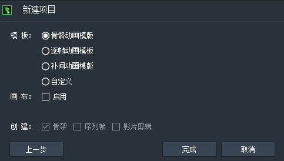
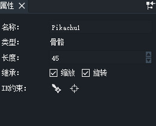
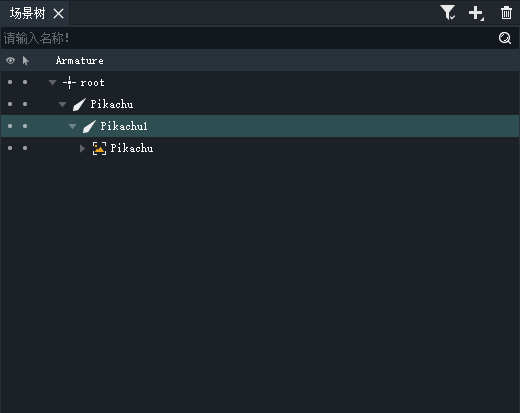
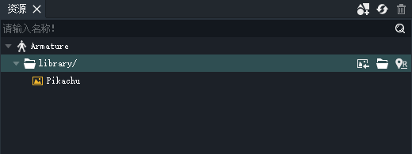
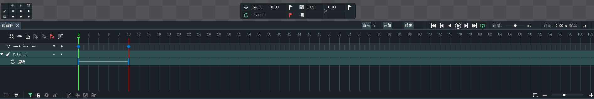

# 龙骨基本概念

## 核心概念

> 骨骼动画

仿照骨骼结构 建立一个节点树 每一个节点算是骨骼的关节，在这些关节上建立关键帧，通过一些计算来生成中间帧。所谓FK和IK，都是计算中间帧节点位置的方法。3D骨骼需要两个步骤，一是rigging（绑骨）就是建立一个骨骼框架，二是skinning（贴图）就是把3D模型对应到骨骼框架上。

> 补间动画

将两个关键帧连接起来，储存关键帧

> 逐帧动画

动画的每一帧都储存在内存里，顺序播放这些帧

> 骨骼约束

通过IK和FK算法来生成骨骼发中间关键帧 给某几条骨骼组合绑定约束

IK(forward kinematics 正向运动)

FK(inverse kinematics 反向运动)

## 龙骨操作面板

> 主面板

> 属性操作面板

> 场景树

> 资源列表

> 动画编辑

## 动画面板

> 如何在某一帧将图片设置为隐藏？

图片的【属性】面板中有个不透明度选项

## 核心操作

> 骨骼创建

1. 在 主面板 右上角有个创建骨骼的icon 点击即可创建

2. 龙骨实现了自动绑定的功能 即骨骼创建时划过哪个图片就将骨骼绑定到哪个图片

3. 可以将游离的骨骼通过 CTROL 键选中后 进行与图片绑定