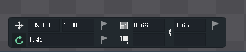

# question-list

## 场景树的资源层级怎么调整

在左上角 【窗口】 -> 【层级】 勾选后 就可以有层级面板

## 已经建好的骨骼怎么移动位置呢

可以移动图片 然后在移动骨骼

## 如何只删除骨骼而不删除骨骼绑定的图片呢

图片 右键 【选择父级】 更改图片的父骨骼

## 怎么控制图片的一端不动一端动呢

把图片在细化 也就是龙骨是以骨骼为核心 分解成更小的图片才可以

## 怎样更好的对图片进行缩放移动旋转

中间下方操作栏 

## 插槽
