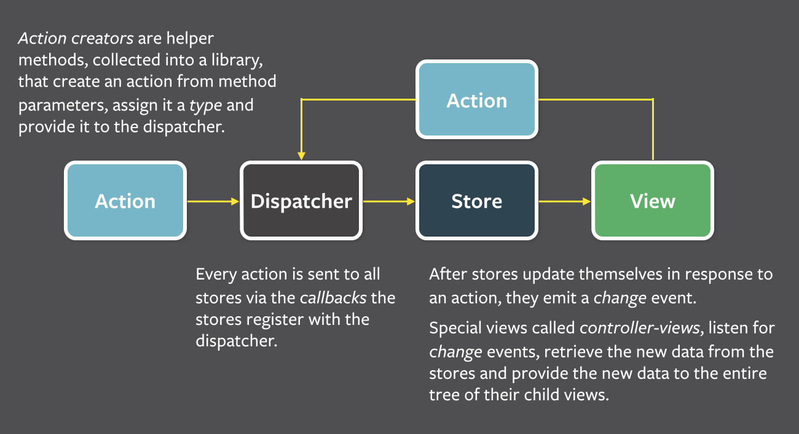
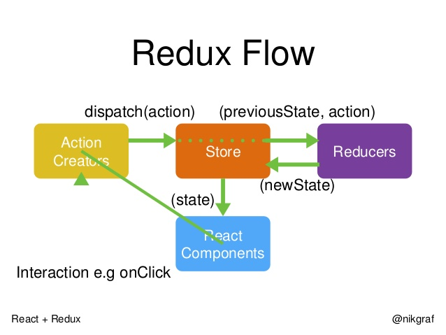
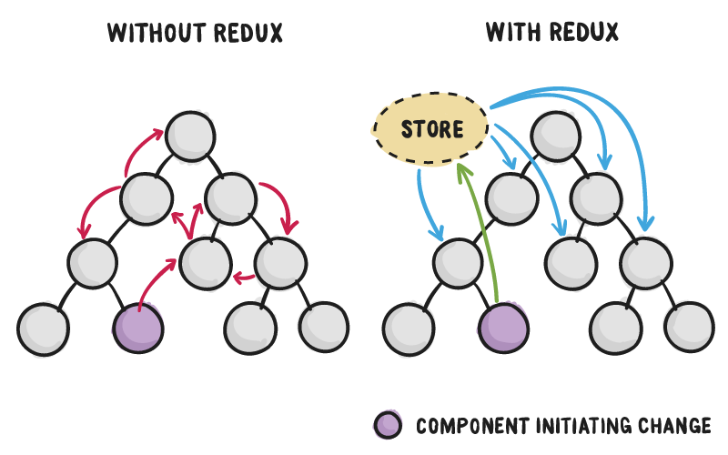

## 参考

- [Hooks 和 Redux ](https://medium.com/enjoy-life-enjoy-coding/react-redux-%E5%B0%8F%E5%AD%A9%E5%AD%90%E6%89%8D%E5%81%9A%E9%81%B8%E6%93%87-hooks-%E5%92%8C-redux-%E6%88%91%E5%85%A8%E9%83%BD%E8%A6%81-1fdd226f5d99) - Hooks 和 Redux 

## TODO LIST

1. 为什么要实现 redux ?

不是父子组件间的状态同步

2. redux 和全局变量有什么区别

> 规范

redux 的变量易于管理（比如可以得到旧的state）可预测的状态管理容器

而全局变量是直接改变 当然也可以封装

3. redux 核心概念

> store

> action

> reducer

4. redux vs vuex

> 都是基于flux

> vuex 是对vue的一层封装只能再vue中使用 redux更通用

> 两者实现异步的方式不一样 [TODO]

Reudx 三个原则

（1）单一数据源（一个Redux应用只有一个store），也是单向的数据流；
（2）state只读（唯一改变 state 的方法就是触发 action，action 是一个用于描述已发生事件的普通对象。）；
（3）使用纯函数（reducer）来修改state。

Vuex 三大原则

a. 应用层级的状态应该集中到单个 store 对象中。
b. 提交 mutation 是更改状态的唯一方法，并且这个过程是同步的。
c. 异步逻辑都应该封装到 action 里面。

