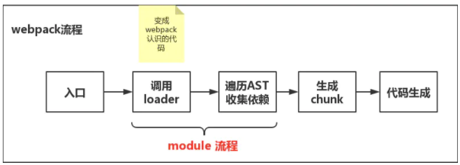

# 实现一个简单的webpack

## webpack流程图



> 具体流程

1. 利用babel完成代码转换，并生成单个文件的依赖: @bable/parse 可以生成 AST; @babel/traverse 进行AST遍历，记录依赖关系；最后用@babel/core和@babel/preset-env进行代码的转换

2. 生成依赖图谱

3. 生成最后打包代码

## 代码实现

> 第一步

```js

// npm install @babel/parse @babel/traverse @babel/core @babel/preset-env

const fs = require('fs')
const path = require('path')
const traverse = require('@babel/traverse').default
const parser = require('@babel/parser')
const babel = require('@babel/core')

function stepOne (filename) {
  // read file
  const ast = readFile(filename)
  // 遍历ast抽象语法
  const dependencies = traverseAST(ast)

  // 通过@babel/core 和 @babel/preset-env 进行代码的转换
  const { code } = babel.transformFromAst(ast, null, {
    presets: ['@babel/preet-env']
  })

  // 返回文件名称 依赖关系
  return {
    filename,
    dependencies,
    code
  }
}

function readFile (filename) {
  const content = fs.readFileSync(filename, 'utf-8')
  const ast = parser.parse(content, {
    sourceType: 'module' // babel官方规定必须加这个参数 不然无法识别ES MODULE
  })
  return ast
}

function traverseAST (ast) {
  const dependencies = {}
  traverse(ast, {
    // 获取通过import引入的模块
    ImportDeclaration({code}) {
      const dirname = path.dirname(filename)
      const newFile = './' + path.join(dirname, node.source.value)
      // 保存所依赖的模块
      dependencies[node.source.value] = newFile
    }
  })
  return dependencies
}


```

> 第二步 生成相应的依赖图

```js
function stepTwo (entry) {
  // 先拿到带有依赖的AST对象
  const entryModule = stepOne(entry)

  // 使用深度优先算法获取图谱
  const graphArray = getGraphArray(entryModule)

  // 生成2图谱
  const graph = getGraph(graphArray) 

  return graph
}

function getGraphArray(entryModule) {
    const graphArray = [entryModule]
    for(let i = 0; i < graphArray.length; i++){
        const item = graphArray[i];
        const {dependencies} = item;//拿到文件所依赖的模块集合(键值对存储)
        for(let j in dependencies){
            graphArray.push(
                one(dependencies[j])
            )//敲黑板！关键代码，目的是将入口模块及其所有相关的模块放入数组
        }
    }
}

function getGraph(graphArray) {
  const graph = {}
  graphArray.forEach(item => {
      graph[item.filename] = {
          dependencies: item.dependencies,
          code: item.code
      }
  })
  return graph
}
```

看到这里就应该大概知道代码是如何处理这种AST树的了，就和算法中处理二叉树是一样，找到规律，不断的循环

> 第三步：生成代码字符串

```js

function stepThree(entry){
    // //要先把对象转换为字符串，不然在下面的模板字符串中会默认调取对象的toString方法，参数变成[Object object],显然不行
    const graph = JSON.stringify(stepTwo(entry))
    
    return `
        (function(graph) {
            //require函数的本质是执行一个模块的代码，然后将相应变量挂载到exports对象上
            function require(module) {
                //localRequire的本质是拿到依赖包的exports变量
                function localRequire(relativePath) {
                    return require(graph[module].dependencies[relativePath]);
                }
                var exports = {};
                (function(require, exports, code) {
                    eval(code);
                })(localRequire, exports, graph[module].code);
                return exports;//函数返回指向局部变量，形成闭包，exports变量在函数执行后不会被摧毁
            }
            require('${entry}')
        })(${graph})`
}

// 可以测试下：console.log(stepThree('./src/index.js'))

```

